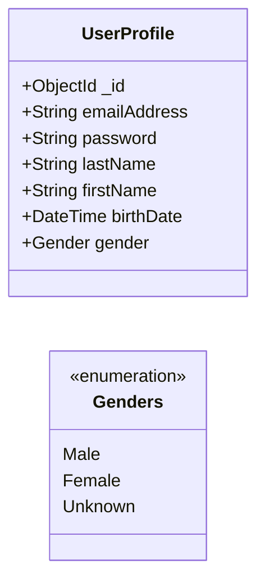

# Domain Model

```mermaid
classDiagram
direction RL
    class UserProfile {
        +ObjectId _id
        +String emailAddress
        +String password
        +String lastName
        +String firstName
        +DateTime birthDate
        +Gender gender
    }

    class Genders {
        <<enumeration>>
        Male
        Female
        Unknown
    }
```
