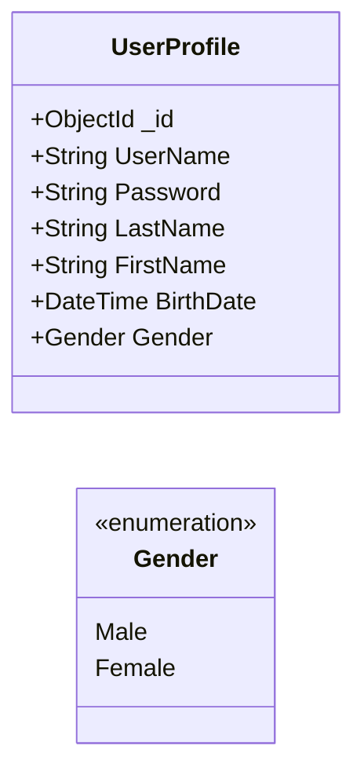

# Domain Model

```mermaid
classDiagram
direction RL
    class UserProfile {
        +ObjectId _id
        +String UserName
        +String Password
        +String LastName
        +String FirstName
        +DateTime BirthDate
        +Gender Gender
    }

    class Gender {
        <<enumeration>>
        Male
        Female
    }
```
